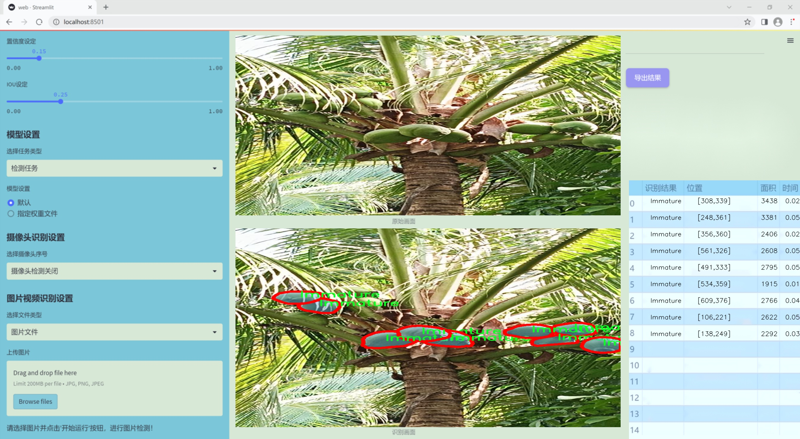
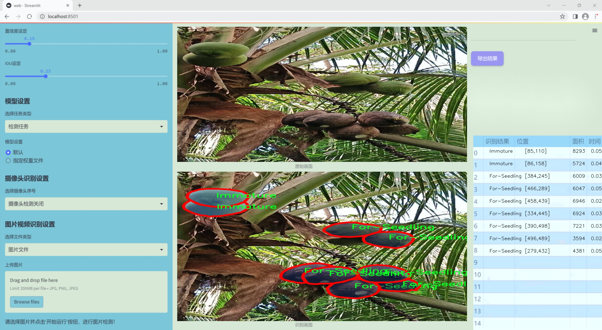
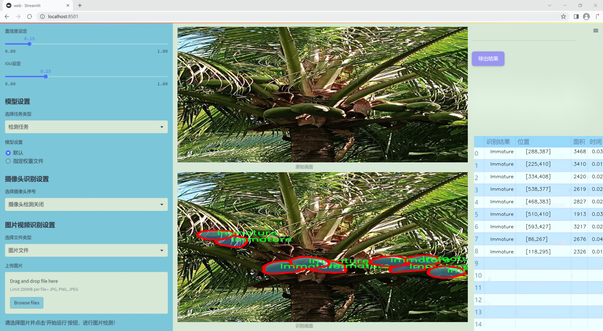
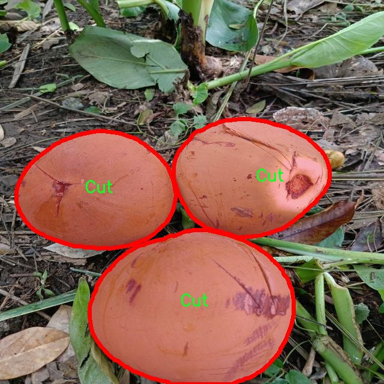
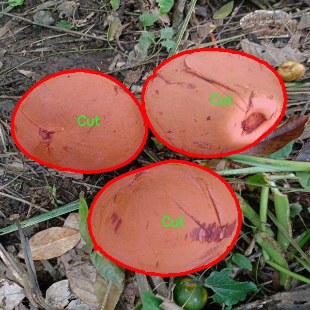
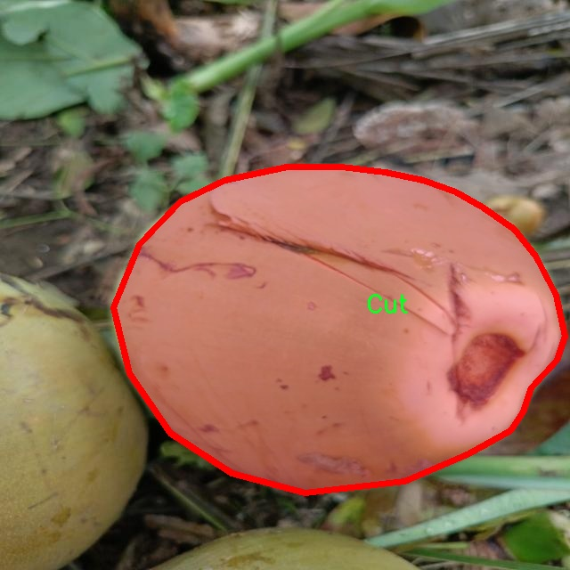
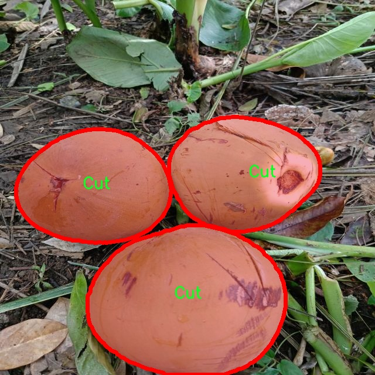
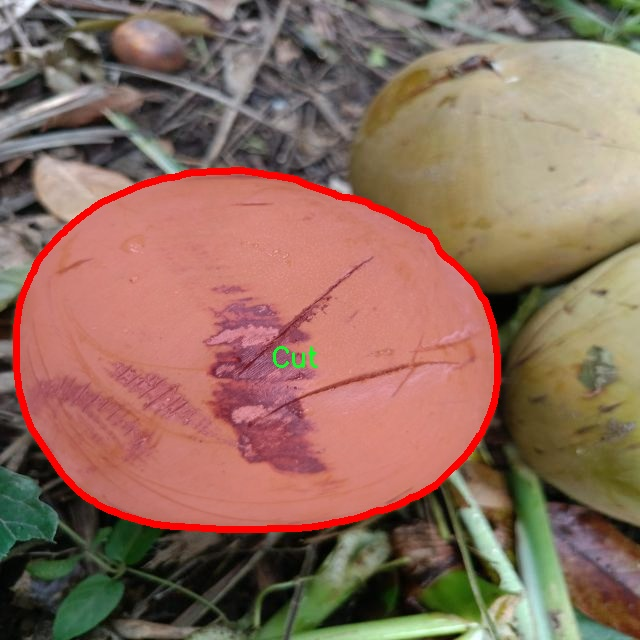

### 1.背景意义

研究背景与意义

随着全球农业生产的不断发展，种子质量的检测与评估已成为确保农作物产量和品质的重要环节。种子是农业生产的基础，其质量直接影响到作物的生长、产量及最终的经济效益。传统的种子质量检测方法往往依赖人工视觉检查，不仅耗时耗力，而且容易受到主观因素的影响，导致检测结果的不准确。因此，开发一种高效、准确的自动化种子质量检测系统显得尤为重要。

近年来，计算机视觉技术的快速发展为种子质量检测提供了新的解决方案。YOLO（You Only Look Once）系列模型因其高效的实时目标检测能力而受到广泛关注。特别是YOLOv11模型的改进，使其在处理复杂场景和多类别物体检测方面表现出色。通过结合深度学习和图像处理技术，基于YOLOv11的种子质量检测系统能够自动识别和分类不同类型的种子缺陷，如切割、变形、适合育苗、未成熟和鼠害损伤等。这不仅提高了检测的准确性和效率，还能显著降低人工成本。

本研究旨在基于改进的YOLOv11模型，构建一个种子质量检测系统，利用收集到的1600张图像数据集进行训练和测试。该数据集涵盖了五种不同的种子质量类别，具有较高的代表性和实用性。通过对图像进行实例分割和特征提取，系统能够实现对种子质量的精确评估，从而为农业生产提供科学依据。此外，研究结果将为后续的种子质量检测技术发展提供参考，推动农业智能化的进程。通过这一系统的实现，期望能够提升种子质量检测的标准化水平，为农业生产的可持续发展贡献力量。

### 2.视频效果

[2.1 视频效果](https://www.bilibili.com/video/BV19YkCYtExN/)

### 3.图片效果







##### [项目涉及的源码数据来源链接](https://kdocs.cn/l/cszuIiCKVNis)**

注意：本项目提供训练的数据集和训练教程,由于版本持续更新,暂不提供权重文件（best.pt）,请按照6.训练教程进行训练后实现上图演示的效果。

### 4.数据集信息

##### 4.1 本项目数据集类别数＆类别名

nc: 5
names: ['Cut', 'Deformed', 'For-Seedling', 'Immature', 'Rodent Damaged']


该项目为【图像分割】数据集，请在【训练教程和Web端加载模型教程（第三步）】这一步的时候按照【图像分割】部分的教程来训练

##### 4.2 本项目数据集信息介绍

本项目数据集信息介绍

本项目所使用的数据集专注于种子质量检测，旨在通过改进YOLOv11模型来提升种子分类的准确性和效率。数据集涵盖了五个主要类别，分别为“Cut”（切割）、“Deformed”（变形）、“For-Seedling”（适合育苗）、“Immature”（未成熟）和“Rodent Damaged”（鼠害损伤）。这些类别的选择反映了种子在农业生产中的不同质量状态，能够为农民和农业生产者提供重要的参考依据。

数据集的构建过程中，收集了大量的种子图像，确保每个类别的样本数量均衡且具有代表性。图像来源于不同的种植环境和条件，以增强模型的泛化能力。每个类别的样本均经过严格的标注和审核，确保数据的准确性和可靠性。这些图像不仅包括了清晰的种子特写，还涵盖了不同光照、背景和角度下的样本，以模拟实际应用中可能遇到的各种情况。

通过使用这一数据集，研究团队希望能够训练出一个高效的种子质量检测系统，能够自动识别和分类不同质量的种子。这不仅可以提高种子筛选的效率，还能减少人为错误，从而为农业生产提供更为科学的决策支持。随着农业科技的不断进步，利用深度学习技术进行种子质量检测将成为未来农业生产的重要趋势。本项目的数据集正是实现这一目标的基础，期待其在实际应用中发挥重要作用。











### 5.全套项目环境部署视频教程（零基础手把手教学）

[5.1 所需软件PyCharm和Anaconda安装教程（第一步）](https://www.bilibili.com/video/BV1BoC1YCEKi/?spm_id_from=333.999.0.0&vd_source=bc9aec86d164b67a7004b996143742dc)


[5.2 安装Python虚拟环境创建和依赖库安装视频教程（第二步）](https://www.bilibili.com/video/BV1ZoC1YCEBw?spm_id_from=333.788.videopod.sections&vd_source=bc9aec86d164b67a7004b996143742dc)

### 6.改进YOLOv11训练教程和Web_UI前端加载模型教程（零基础手把手教学）

[6.1 改进YOLOv11训练教程和Web_UI前端加载模型教程（第三步）](https://www.bilibili.com/video/BV1BoC1YCEhR?spm_id_from=333.788.videopod.sections&vd_source=bc9aec86d164b67a7004b996143742dc)


按照上面的训练视频教程链接加载项目提供的数据集，运行train.py即可开始训练



     Epoch   gpu_mem       box       obj       cls    labels  img_size
     1/200     20.8G   0.01576   0.01955  0.007536        22      1280: 100%|██████████| 849/849 [14:42<00:00,  1.04s/it]
               Class     Images     Labels          P          R     mAP@.5 mAP@.5:.95: 100%|██████████| 213/213 [01:14<00:00,  2.87it/s]
                 all       3395      17314      0.994      0.957      0.0957      0.0843

     Epoch   gpu_mem       box       obj       cls    labels  img_size
     2/200     20.8G   0.01578   0.01923  0.007006        22      1280: 100%|██████████| 849/849 [14:44<00:00,  1.04s/it]
               Class     Images     Labels          P          R     mAP@.5 mAP@.5:.95: 100%|██████████| 213/213 [01:12<00:00,  2.95it/s]
                 all       3395      17314      0.996      0.956      0.0957      0.0845

     Epoch   gpu_mem       box       obj       cls    labels  img_size
     3/200     20.8G   0.01561    0.0191  0.006895        27      1280: 100%|██████████| 849/849 [10:56<00:00,  1.29it/s]
               Class     Images     Labels          P          R     mAP@.5 mAP@.5:.95: 100%|███████   | 187/213 [00:52<00:00,  4.04it/s]
                 all       3395      17314      0.996      0.957      0.0957      0.0845


###### [项目数据集下载链接](https://kdocs.cn/l/cszuIiCKVNis)

### 7.原始YOLOv11算法讲解


ultralytics发布了最新的作品YOLOv11，这一次YOLOv11的变化相对于ultralytics公司的上一代作品YOLOv8变化不是很大的（YOLOv9、YOLOv10均不是ultralytics公司作品），其中改变的位置涉及到C2f变为C3K2，在SPPF后面加了一层类似于注意力机制的C2PSA，还有一个变化大家从yaml文件是看不出来的就是它的检测头内部替换了两个DWConv，以及模型的深度和宽度参数进行了大幅度调整，但是在损失函数方面就没有变化还是采用的CIoU作为边界框回归损失，下面带大家深入理解一下ultralytics最新作品YOLOv11的创新点。

**下图为最近的YOLO系列发布时间线！**


* * *

###### YOLOv11和YOLOv8对比

在YOLOYOLOv5，YOLOv8，和YOLOv11是ultralytics公司作品（ultralytics出品必属精品），下面用一张图片从yaml文件来带大家对比一下YOLOv8和YOLOv11的区别，配置文件变得内容比较少大家可以看一卡，左侧为YOLOv8右侧为YOLOv11，不同的点我用黑线标注了出来。


* * *

###### YOLOv11的网络结构解析

下面的图片为YOLOv11的网络结构图。


**其中主要创新点可以总结如下- > **

* * *

1\.
提出C3k2机制，其中C3k2有参数为c3k，其中在网络的浅层c3k设置为False（下图中可以看到c3k2第二个参数被设置为False，就是对应的c3k参数）。


此时所谓的C3k2就相当于YOLOv8中的C2f，其网络结构为一致的，其中的C3k机制的网络结构图如下图所示
**（为什么叫C3k2，我个人理解是因为C3k的调用时C3k其中的参数N固定设置为2的原因，个人理解不一定对** ）。


* * *

2\.
第二个创新点是提出C2PSA机制，这是一个C2（C2f的前身）机制内部嵌入了一个多头注意力机制，在这个过程中我还发现作者尝试了C2fPSA机制但是估计效果不如C2PSA，有的时候机制有没有效果理论上真的很难解释通，下图为C2PSA机制的原理图，仔细观察把Attention哪里去掉则C2PSA机制就变为了C2所以我上面说C2PSA就是C2里面嵌入了一个PSA机制。


* * *

3\.
第三个创新点可以说是原先的解耦头中的分类检测头增加了两个DWConv，具体的对比大家可以看下面两个图下面的是YOLOv11的解耦头，上面的是YOLOv8的解耦头.


我们上面看到了在分类检测头中YOLOv11插入了两个DWConv这样的做法可以大幅度减少参数量和计算量（原先两个普通的Conv大家要注意到卷积和是由3变为了1的，这是形成了两个深度可分离Conv），大家可能不太理解为什么加入了两个DWConv还能够减少计算量，以及什么是深度可分离Conv，下面我来解释一下。

> **`DWConv` 代表 Depthwise
> Convolution（深度卷积）**，是一种在卷积神经网络中常用的高效卷积操作。它主要用于减少计算复杂度和参数量，尤其在移动端或轻量化网络（如
> MobileNet）中十分常见。
>
> **1\. 标准卷积的计算过程**
>
> 在标准卷积操作中，对于一个输入张量（通常是一个多通道的特征图），卷积核的尺寸是 `(h, w, C_in)`，其中 `h` 和 `w`
> 是卷积核的空间尺寸，`C_in`
> 是输入通道的数量。而卷积核与输入张量做的是完整的卷积运算，每个输出通道都与所有输入通道相连并参与卷积操作，导致计算量比较大。
>
> 标准卷积的计算过程是这样的：
>
>   * 每个输出通道是所有输入通道的组合（加权求和），卷积核在每个位置都会计算与所有输入通道的点积。
>   * 假设有 `C_in` 个输入通道和 `C_out` 个输出通道，那么卷积核的总参数量是 `C_in * C_out * h * w`。
>

>
> 2\. **Depthwise Convolution（DWConv）**
>
> 与标准卷积不同， **深度卷积** 将输入的每个通道单独处理，即 **每个通道都有自己的卷积核进行卷积**
> ，不与其他通道进行交互。它可以被看作是标准卷积的一部分，专注于空间维度上的卷积运算。
>
> **深度卷积的计算过程：**
>
>   * 假设输入张量有 `C_in` 个通道，每个通道会使用一个 `h × w`
> 的卷积核进行卷积操作。这个过程称为“深度卷积”，因为每个通道独立进行卷积运算。
>   * 输出的通道数与输入通道数一致，每个输出通道只和对应的输入通道进行卷积，没有跨通道的组合。
>   * 参数量和计算量相比标准卷积大大减少，卷积核的参数量是 `C_in * h * w`。
>

>
> **深度卷积的优点：**
>
>   1. **计算效率高** ：相对于标准卷积，深度卷积显著减少了计算量。它只处理空间维度上的卷积，不再处理通道间的卷积。
>   2.  **参数量减少** ：由于每个卷积核只对单个通道进行卷积，参数量大幅减少。例如，标准卷积的参数量为 `C_in * C_out * h *
> w`，而深度卷积的参数量为 `C_in * h * w`。
>   3.  **结合点卷积可提升效果** ：为了弥补深度卷积缺乏跨通道信息整合的问题，通常深度卷积后会配合 `1x1` 的点卷积（Pointwise
> Convolution）使用，通过 `1x1` 的卷积核整合跨通道的信息。这种组合被称为 **深度可分离卷积** （Depthwise
> Separable Convolution） | **这也是我们本文YOLOv11中的做法** 。
>

>
> 3\. **深度卷积与标准卷积的区别**
>
> 操作类型| 卷积核大小| 输入通道数| 输出通道数| 参数量  
> ---|---|---|---|---  
> 标准卷积| `h × w`| `C_in`| `C_out`| `C_in * C_out * h * w`  
> 深度卷积（DWConv）| `h × w`| `C_in`| `C_in`| `C_in * h * w`  
>  
> 可以看出，深度卷积在相同的卷积核大小下，参数量减少了约 `C_out` 倍
> （细心的人可以发现用最新版本的ultralytics仓库运行YOLOv8参数量相比于之前的YOLOv8以及大幅度减少了这就是因为检测头改了的原因但是名字还是Detect，所以如果你想继续用YOLOv8发表论文做实验那么不要更新最近的ultralytics仓库）。
>
> **4\. 深度可分离卷积 (Depthwise Separable Convolution)**
>
> 深度卷积常与 `1x1` 的点卷积配合使用，这称为深度可分离卷积。其过程如下：
>
>   1. 先对输入张量进行深度卷积，对每个通道独立进行空间卷积。
>   2. 然后通过 `1x1` 点卷积，对通道维度进行混合，整合不同通道的信息。
>

>
> 这样既可以保证计算量的减少，又可以保持跨通道的信息流动。
>
> 5\. **总结**
>
> `DWConv` 是一种高效的卷积方式，通过单独处理每个通道来减少计算量，结合 `1x1`
> 的点卷积，形成深度可分离卷积，可以在保持网络性能的同时极大地减少模型的计算复杂度和参数量。

**看到这里大家应该明白了为什么加入了两个DWConv还能减少参数量以及YOLOv11的检测头创新点在哪里。**

* * *

##### YOLOv11和YOLOv8还有一个不同的点就是其各个版本的模型（N - S - M- L - X）网络深度和宽度变了


可以看到在深度（depth）和宽度
（width）两个地方YOLOv8和YOLOv11是基本上完全不同了，这里我理解这么做的含义就是模型网络变小了，所以需要加深一些模型的放缩倍数来弥补模型之前丧失的能力从而来达到一个平衡。

> **本章总结：**
> YOLOv11的改进点其实并不多更多的都是一些小的结构上的创新，相对于之前的YOLOv5到YOLOv8的创新，其实YOLOv11的创新点不算多，但是其是ultralytics公司的出品，同时ultralytics仓库的使用量是非常多的（不像YOLOv9和YOLOv10）所以在未来的很长一段时间内其实YOLO系列估计不会再更新了，YOLOv11作为最新的SOTA肯定是十分适合大家来发表论文和创新的。
>

### 8.200+种全套改进YOLOV11创新点原理讲解

#### 8.1 200+种全套改进YOLOV11创新点原理讲解大全

由于篇幅限制，每个创新点的具体原理讲解就不全部展开，具体见下列网址中的改进模块对应项目的技术原理博客网址【Blog】（创新点均为模块化搭建，原理适配YOLOv5~YOLOv11等各种版本）

[改进模块技术原理博客【Blog】网址链接](https://gitee.com/qunmasj/good)


#### 8.2 精选部分改进YOLOV11创新点原理讲解

###### 这里节选部分改进创新点展开原理讲解(完整的改进原理见上图和[改进模块技术原理博客链接](https://gitee.com/qunmasj/good)【如果此小节的图加载失败可以通过CSDN或者Github搜索该博客的标题访问原始博客，原始博客图片显示正常】
### 可变性卷积DCN简介
卷积神经网络由于其构建模块中固定的几何结构，本质上受限于模型几何变换。为了提高卷积神经网络的转换建模能力，《Deformable Convolutional Networks》作者提出了两个模块：可变形卷积（deformable convolution）和可变形RoI池（deformable RoI pooling）。这两个模块均基于用额外的偏移来增加模块中的空间采样位置以及从目标任务中学习偏移的思想，而不需要额外的监督。

第一次证明了在深度神经网络中学习密集空间变换（dense spatial transformation）对于复杂的视觉任务是有效的

视觉识别中的一个关键挑战是如何适应对象比例、姿态、视点和零件变形中的几何变化或模型几何变换。一般有两种方法实现：
1）建立具有足够期望变化的训练数据集。这通常通过增加现有的数据样本来实现，例如通过仿射变换。但是训练成本昂贵而且模型参数庞大。
2）使用变换不变（transformation-invariant）的特征和算法。比如比较有名的SIFT(尺度不变特征变换)便是这一类的代表算法。

但以上的方法有两个缺点：
1）几何变换被假定为固定的和已知的，这些先验知识被用来扩充数据，设计特征和算法。为此，这个假设阻止了对具有未知几何变换的新任务的推广，从而导致这些几何变换可能没有被正确建模。
2）对于不变特征和算法进行手动设计，对于过于复杂的变换可能是困难的或不可行的。

卷积神经网络本质上局限于模拟大型未知转换。局限性源于CNN模块的固定几何结构：卷积单元在固定位置对输入特征图进行采样；池化层以固定比率降低特征矩阵分辨率；RoI（感兴趣区域）池化层将RoI分成固定的空间箱（spatial bins）等。缺乏处理几何变换的内部机制。

这种内部机制的缺乏会导致一些问题，举个例子。同一个CNN层中所有激活单元的感受野大小是相同的，但是这是不可取的。因为不同的位置可能对应于具有不同尺度或变形的对象，所以尺度或感受野大小的自适应确定对于具有精细定位的视觉识别是渴望的。

对于这些问题，作者提出了两个模块提高CNNs对几何变换建模的能力。


deformable convolution（可变形卷积）
将2D偏移量添加到标准卷积中的常规网格采样位置，使得采样网格能够自由变形。通过额外的卷积层，从前面的特征映射中学习偏移。因此，变形采用局部、密集和自适应的方式取决于输入特征。


deformable RoI pooling（可变形RoI池化）
为先前RoI池化的常规库（bin）分区中的每个库位置（bin partition）增加了一个偏移量。类似地，偏移是从前面的特征图和感兴趣区域中学习的，从而能够对具有不同形状的对象进行自适应部件定位（adaptive part localization）。

#### Deformable Convolutional Networks
Deformable Convolution
2D卷积由两个步骤组成：
1）在输入特征图x xx上使用规则网格R RR进行采样。
2）把这些采样点乘不同权重w ww后相加。

网格R定义感受野大小和扩张程度，比如内核大小为3x3，扩张程度为1的网格R可以表示为：
R = { ( − 1 , − 1 ) , ( − 1 , 0 ) , … , ( 0 , 1 ) , ( 1 , 1 ) } R = \{(-1,-1),(-1,0),\dots,(0,1),(1,1)\}
R={(−1,−1),(−1,0),…,(0,1),(1,1)}

​
 一般为小数，使用双线性插值进行处理。（把小数坐标分解到相邻的四个整数坐标点来计算结果）


具体操作如图所示：


首先对输入特征层进行一个普通的3x3卷积处理得到偏移域（offset field）。偏移域特征图具有与输入特征图相同的空间分辨率，channels维度2N对应于N个2D（xy两个方向）偏移。其中的N是原输入特征图上所具有的N个channels，也就是输入输出channels保持不变，这里xy两个channels分别对输出特征图上的一个channels进行偏移。确定采样点后就通过与相对应的权重w点乘相加得到输出特征图上该点最终值。

前面也提到过，由于这里xy两个方向所训练出来的偏移量一般来说是一个小数，那么为了得到这个点所对应的数值，会采用双线性插值的方法，从最近的四个邻近坐标点中计算得到该偏移点的数值，公式如下：


具体推理过程见：双线性插值原理

#### Deformable RoI Poolingb
所有基于区域提议（RPN）的对象检测方法都使用RoI池话处理，将任意大小的输入矩形区域转换为固定大小的特征图。


 一般为小数，需要使用双线性插值进行处理。


具体操作如图所示：


当时看这个部分的时候觉得有些突兀，明明RoI池化会将特征层转化为固定尺寸的区域。其实，我个人觉得，这个部分与上述的可变性卷积操作是类似的。这里同样是使用了一个普通的RoI池化操作，进行一些列处理后得到了一个偏移域特征图，然后重新作用于原来的w × H w \times Hw×H的RoI。只不过这里不再是规律的逐行逐列对每个格子进行池化，而是对于格子进行偏移后再池化处理。

#### Postion﹣Sensitive RoI Pooling
除此之外，论文还提出一种PS RoI池化（Postion﹣Sensitive RoI Pooling）。不同于上述可变形RoI池化中的全连接过程，这里使用全卷积替换。

具体操作如图所示：


首先，对于原来的特征图来说，原本是将输入特征图上的RoI区域分成k × k k\times kk×k个bin。而在这里，则是将输入特征图进行卷积操作，分别得到一个channels为k 2 ( C + 1 ) k^{2}(C+1)k (C+1)的得分图（score maps）和一个channels为2 k 2 ( C + 1 ) 2k{2}(C+1)2k 2 (C+1)的偏移域（offset fields），这两个特征矩阵的宽高是与输入特征矩阵相同的。其中，得分图的channels中，k × k k \times kk×k分别表示的是每一个网格，C CC表示的检测对象的类别数目，1表示背景。而在偏移域中的2表示xy两个方向的偏移。
也就是说，在PS RoI池化中，对于RoI的每一个网格都独自占一个通道形成一层得分图，然后其对于的偏移量占两个通道。offset fields得到的偏移是归一化后的偏移，需要通过和deformable RoI pooling中一样的变换方式得到∆ p i j ∆p_{ij}∆p ij，然后对每层得分图进行偏移池化处理。最后处理完的结果就对应着最后输出的一个网格。所以其包含了位置信息。

原文论述为：


#### Understanding Deformable ConvNets
当可变形卷积叠加时，复合变形的效果是深远的。如图所示：


ps：a是标准卷积的固定感受野，b是可变形卷积的适应性感受野。

感受野和标准卷积中的采样位置在整个顶部特征图上是固定的(左)。在可变形卷积中，它们根据对象的比例和形状进行自适应调整(右)。


### 9.系统功能展示

图9.1.系统支持检测结果表格显示

  图9.2.系统支持置信度和IOU阈值手动调节

  图9.3.系统支持自定义加载权重文件best.pt(需要你通过步骤5中训练获得)

  图9.4.系统支持摄像头实时识别

  图9.5.系统支持图片识别

  图9.6.系统支持视频识别

  图9.7.系统支持识别结果文件自动保存

  图9.8.系统支持Excel导出检测结果数据


### 10. YOLOv11核心改进源码讲解

#### 10.1 TransNext.py

以下是对给定代码的逐行分析，并保留了核心部分，同时添加了详细的中文注释：

```python
try:
    # 尝试导入swattention模块和TransNext_cuda中的所有内容
    import swattention
    from ultralytics.nn.backbone.TransNeXt.TransNext_cuda import *
except ImportError as e:
    # 如果导入失败（例如模块不存在），则导入TransNext_native中的所有内容
    from ultralytics.nn.backbone.TransNeXt.TransNext_native import *
    pass
```

### 核心部分分析

1. **导入模块**：
   - 代码首先尝试导入`swattention`模块以及`TransNext_cuda`中的所有内容。这通常是为了利用CUDA加速的版本以提高性能。
   - 如果导入成功，后续代码将使用这些导入的内容。

2. **异常处理**：
   - 使用`try...except`结构来处理可能出现的导入错误。如果`swattention`或`TransNext_cuda`模块不可用，程序将捕获`ImportError`异常。
   - 在捕获到异常后，代码将尝试导入`TransNext_native`中的所有内容。这意味着即使在缺少CUDA支持的情况下，程序仍然可以继续运行，使用CPU版本的实现。

### 总结
这段代码的核心功能是根据环境的不同选择合适的模块进行导入，确保在不同的硬件条件下都能正常运行。通过这种方式，代码具有更好的兼容性和灵活性。

这个程序文件名为 `TransNext.py`，其主要功能是导入与 `TransNeXt` 相关的模块。首先，代码使用 `try` 语句尝试导入 `swattention` 模块以及 `TransNext_cuda` 中的内容。如果这个导入过程没有出现错误，程序将继续执行这些导入的内容。

然而，如果在导入过程中发生了 `ImportError`（即找不到指定的模块），程序会进入 `except` 块。在这个块中，程序会尝试导入 `TransNext_native` 中的内容，而不是 `TransNext_cuda`。这意味着程序设计了一个容错机制，以确保即使在某些环境中缺少 CUDA 支持或相关模块，程序仍然能够正常运行。

总的来说，这段代码的目的是为了确保在不同的环境下都能灵活地加载 `TransNeXt` 模块，提供了对 CUDA 加速和非 CUDA 版本的支持。这样的设计在深度学习和计算机视觉领域中是非常常见的，因为不同的硬件环境可能会影响模块的可用性。

#### 10.2 SwinTransformer.py

以下是经过简化和注释的核心代码部分，主要包含了Swin Transformer的基本结构和功能。

```python
import torch
import torch.nn as nn
import torch.nn.functional as F
import numpy as np

class Mlp(nn.Module):
    """ 多层感知机 (MLP) 模块 """
    
    def __init__(self, in_features, hidden_features=None, out_features=None, act_layer=nn.GELU, drop=0.):
        super().__init__()
        out_features = out_features or in_features  # 输出特征数
        hidden_features = hidden_features or in_features  # 隐藏层特征数
        self.fc1 = nn.Linear(in_features, hidden_features)  # 第一层线性变换
        self.act = act_layer()  # 激活函数
        self.fc2 = nn.Linear(hidden_features, out_features)  # 第二层线性变换
        self.drop = nn.Dropout(drop)  # Dropout层

    def forward(self, x):
        """ 前向传播 """
        x = self.fc1(x)  # 线性变换
        x = self.act(x)  # 激活
        x = self.drop(x)  # Dropout
        x = self.fc2(x)  # 线性变换
        x = self.drop(x)  # Dropout
        return x

class WindowAttention(nn.Module):
    """ 窗口注意力机制 (Window-based Multi-head Self Attention) """
    
    def __init__(self, dim, window_size, num_heads):
        super().__init__()
        self.dim = dim
        self.window_size = window_size  # 窗口大小
        self.num_heads = num_heads  # 注意力头数
        head_dim = dim // num_heads  # 每个头的维度
        self.scale = head_dim ** -0.5  # 缩放因子

        # 位置偏置参数
        self.relative_position_bias_table = nn.Parameter(
            torch.zeros((2 * window_size[0] - 1) * (2 * window_size[1] - 1), num_heads))

        # 计算相对位置索引
        coords_h = torch.arange(self.window_size[0])
        coords_w = torch.arange(self.window_size[1])
        coords = torch.stack(torch.meshgrid([coords_h, coords_w]))  # 生成坐标网格
        coords_flatten = torch.flatten(coords, 1)  # 展平
        relative_coords = coords_flatten[:, :, None] - coords_flatten[:, None, :]  # 计算相对坐标
        relative_coords = relative_coords.permute(1, 2, 0).contiguous()  # 调整维度
        relative_coords[:, :, 0] += self.window_size[0] - 1  # 调整偏移
        relative_coords[:, :, 1] += self.window_size[1] - 1
        relative_coords[:, :, 0] *= 2 * self.window_size[1] - 1
        self.relative_position_index = relative_coords.sum(-1)  # 相对位置索引

        self.qkv = nn.Linear(dim, dim * 3)  # 线性变换用于生成Q, K, V
        self.softmax = nn.Softmax(dim=-1)  # Softmax层

    def forward(self, x):
        """ 前向传播 """
        B_, N, C = x.shape  # B: 批量大小, N: 序列长度, C: 特征维度
        qkv = self.qkv(x).reshape(B_, N, 3, self.num_heads, C // self.num_heads).permute(2, 0, 3, 1, 4)
        q, k, v = qkv[0], qkv[1], qkv[2]  # 分离Q, K, V

        q = q * self.scale  # 缩放Q
        attn = (q @ k.transpose(-2, -1))  # 计算注意力分数

        # 添加相对位置偏置
        relative_position_bias = self.relative_position_bias_table[self.relative_position_index.view(-1)].view(
            self.window_size[0] * self.window_size[1], self.window_size[0] * self.window_size[1], -1)
        attn = attn + relative_position_bias.unsqueeze(0)  # 加入偏置

        attn = self.softmax(attn)  # Softmax归一化
        x = (attn @ v).transpose(1, 2).reshape(B_, N, C)  # 计算输出
        return x

class SwinTransformerBlock(nn.Module):
    """ Swin Transformer块 """
    
    def __init__(self, dim, num_heads, window_size=7, shift_size=0):
        super().__init__()
        self.attn = WindowAttention(dim, window_size, num_heads)  # 注意力层
        self.norm1 = nn.LayerNorm(dim)  # 归一化层
        self.norm2 = nn.LayerNorm(dim)  # 归一化层
        self.mlp = Mlp(in_features=dim, hidden_features=int(dim * 4))  # MLP层

    def forward(self, x):
        """ 前向传播 """
        shortcut = x  # 残差连接
        x = self.norm1(x)  # 归一化
        x = self.attn(x)  # 注意力计算
        x = shortcut + x  # 残差连接
        x = x + self.mlp(self.norm2(x))  # MLP层
        return x

class SwinTransformer(nn.Module):
    """ Swin Transformer主类 """
    
    def __init__(self, depths, num_heads):
        super().__init__()
        self.layers = nn.ModuleList([
            SwinTransformerBlock(dim=96 * (2 ** i), num_heads=num_heads[i]) for i in range(len(depths))
        ])  # 构建多个Swin Transformer块

    def forward(self, x):
        """ 前向传播 """
        for layer in self.layers:
            x = layer(x)  # 逐层计算
        return x

# 示例：创建一个Swin Transformer模型
def SwinTransformer_Tiny():
    model = SwinTransformer(depths=[2, 2, 6, 2], num_heads=[3, 6, 12, 24])
    return model
```

### 代码说明：
1. **Mlp类**：实现了一个简单的多层感知机，包括两个线性层和一个激活函数（GELU）。
2. **WindowAttention类**：实现了窗口注意力机制，计算Q、K、V，并引入相对位置偏置。
3. **SwinTransformerBlock类**：构建了一个Swin Transformer块，包含注意力层和MLP层，并实现了残差连接。
4. **SwinTransformer类**：主类，负责构建多个Swin Transformer块并进行前向传播。
5. **SwinTransformer_Tiny函数**：示例函数，用于创建一个小型的Swin Transformer模型。

这个简化版本保留了Swin Transformer的核心结构和功能，注释详细说明了每个部分的作用。

这个程序文件实现了Swin Transformer模型的结构，Swin Transformer是一种基于视觉的Transformer架构，采用了分层的方式和窗口注意力机制，适用于图像处理任务。文件中包含多个类和函数，以下是对其主要内容的讲解。

首先，导入了必要的库，包括PyTorch的核心模块和一些实用的函数。接着定义了一个名为`Mlp`的类，表示多层感知机（MLP），该类包含两个线性层和一个激活函数（默认为GELU），并在每个线性层后添加了Dropout以防止过拟合。

接下来，定义了`window_partition`和`window_reverse`两个函数，分别用于将输入特征图分割成窗口和将窗口合并回特征图。这是Swin Transformer中窗口注意力机制的基础。

`WindowAttention`类实现了窗口基础的多头自注意力机制，支持相对位置偏置。该类的构造函数中定义了输入通道数、窗口大小、注意力头数等参数，并初始化了相对位置偏置表和其他必要的线性层。在前向传播中，输入特征经过线性变换得到查询、键、值，然后计算注意力权重，并应用相对位置偏置。

`SwinTransformerBlock`类实现了Swin Transformer的基本块，包含了窗口注意力和前馈网络。该类在构造函数中初始化了归一化层、窗口注意力模块和MLP，并在前向传播中实现了特征的规范化、窗口分割、注意力计算和特征的合并。

`PatchMerging`类用于将特征图中的补丁合并，降低特征图的分辨率。它通过线性层将4个输入通道合并为2个输出通道，并在合并前进行归一化。

`BasicLayer`类表示Swin Transformer的一个基本层，包含多个Swin Transformer块，并在必要时进行下采样。该类计算了用于窗口注意力的掩码，并在前向传播中依次调用每个块。

`PatchEmbed`类负责将输入图像分割成补丁并进行嵌入，使用卷积层将图像的每个补丁映射到一个高维空间。

`SwinTransformer`类是整个模型的主类，负责构建Swin Transformer的各个层。它在构造函数中初始化了补丁嵌入、绝对位置嵌入、各层和归一化层，并在前向传播中依次通过每一层，最终输出所需的特征。

最后，定义了`update_weight`函数用于更新模型的权重，并提供了一个名为`SwinTransformer_Tiny`的函数，用于创建一个小型的Swin Transformer模型实例，并可选择加载预训练权重。

总体而言，这个程序文件提供了Swin Transformer的完整实现，涵盖了模型的各个组成部分和功能，适合用于图像分类、目标检测等视觉任务。

#### 10.3 test_selective_scan.py

以下是经过简化和注释的核心代码部分，主要集中在 `build_selective_scan_fn` 函数及其内部的 `SelectiveScanFn` 类上。该代码实现了一个选择性扫描的功能，主要用于深度学习中的序列处理。

```python
import torch
import torch.nn.functional as F

def build_selective_scan_fn(selective_scan_cuda: object = None, mode="mamba_ssm", tag=None):
    """
    构建选择性扫描函数。
    
    参数:
    selective_scan_cuda: 选择性扫描的CUDA实现。
    mode: 选择性扫描的模式。
    tag: 额外的标签信息。
    
    返回:
    一个选择性扫描函数。
    """
    
    class SelectiveScanFn(torch.autograd.Function):
        @staticmethod
        def forward(ctx, u, delta, A, B, C, D=None, z=None, delta_bias=None, delta_softplus=False, return_last_state=False, nrows=1, backnrows=-1):
            """
            前向传播函数，计算选择性扫描的输出。
            
            参数:
            ctx: 上下文对象，用于保存信息以便反向传播。
            u: 输入张量。
            delta: 变化率张量。
            A, B, C: 权重张量。
            D: 可选的偏置张量。
            z: 可选的张量。
            delta_bias: 可选的变化率偏置。
            delta_softplus: 是否使用softplus激活。
            return_last_state: 是否返回最后的状态。
            nrows: 行数参数。
            backnrows: 反向传播时的行数参数。
            
            返回:
            输出张量，或输出和最后状态的元组。
            """
            # 确保输入张量是连续的
            if u.stride(-1) != 1:
                u = u.contiguous()
            if delta.stride(-1) != 1:
                delta = delta.contiguous()
            if D is not None:
                D = D.contiguous()
            if B.stride(-1) != 1:
                B = B.contiguous()
            if C.stride(-1) != 1:
                C = C.contiguous()
            if z is not None and z.stride(-1) != 1:
                z = z.contiguous()

            # 处理权重张量的维度
            if B.dim() == 3:
                B = rearrange(B, "b dstate l -> b 1 dstate l")
                ctx.squeeze_B = True
            if C.dim() == 3:
                C = rearrange(C, "b dstate l -> b 1 dstate l")
                ctx.squeeze_C = True

            # 确保数据类型为float
            if D is not None and (D.dtype != torch.float):
                ctx._d_dtype = D.dtype
                D = D.float()
            if delta_bias is not None and (delta_bias.dtype != torch.float):
                ctx._delta_bias_dtype = delta_bias.dtype
                delta_bias = delta_bias.float()

            # 确保输入形状的有效性
            assert u.shape[1] % (B.shape[1] * nrows) == 0 
            assert nrows in [1, 2, 3, 4]

            # 选择合适的CUDA实现进行前向计算
            if mode == "mamba_ssm":
                out, x, *rest = selective_scan_cuda.fwd(u, delta, A, B, C, D, z, delta_bias, delta_softplus)
            else:
                raise NotImplementedError

            # 保存必要的张量以供反向传播使用
            ctx.save_for_backward(u, delta, A, B, C, D, delta_bias, x)

            # 计算最后的状态
            last_state = x[:, :, -1, 1::2]  # (batch, dim, dstate)
            return out if not return_last_state else (out, last_state)

        @staticmethod
        def backward(ctx, dout):
            """
            反向传播函数，计算梯度。
            
            参数:
            ctx: 上下文对象，包含前向传播时保存的信息。
            dout: 输出的梯度。
            
            返回:
            输入张量的梯度。
            """
            # 从上下文中恢复保存的张量
            u, delta, A, B, C, D, delta_bias, x = ctx.saved_tensors
            
            # 确保输出梯度是连续的
            if dout.stride(-1) != 1:
                dout = dout.contiguous()

            # 使用CUDA实现进行反向计算
            du, ddelta, dA, dB, dC, dD, ddelta_bias, *rest = selective_scan_cuda.bwd(
                u, delta, A, B, C, D, delta_bias, dout, x, ctx.delta_softplus
            )

            # 返回各个输入的梯度
            return (du, ddelta, dA, dB, dC, dD if D is not None else None, ddelta_bias if delta_bias is not None else None)

    # 返回选择性扫描函数
    return SelectiveScanFn.apply
```

### 代码说明：
1. **`build_selective_scan_fn`**: 该函数用于构建选择性扫描的前向和反向传播函数。它接收一个CUDA实现和模式参数，并返回一个可以在PyTorch中使用的函数。

2. **`SelectiveScanFn`**: 这是一个自定义的PyTorch函数类，继承自 `torch.autograd.Function`。它实现了前向传播和反向传播的方法。

3. **`forward` 方法**: 该方法执行选择性扫描的前向计算，处理输入张量的形状和数据类型，并调用相应的CUDA实现进行计算。它还保存必要的张量以供反向传播使用。

4. **`backward` 方法**: 该方法计算输入张量的梯度，使用保存的张量和输出的梯度来调用CUDA实现的反向计算。

通过这种方式，代码实现了高效的选择性扫描操作，并且能够在深度学习模型中进行自动微分。

这个程序文件 `test_selective_scan.py` 主要实现了一个选择性扫描（Selective Scan）操作的功能，并且包含了相应的测试代码。选择性扫描是一种在深度学习中常用的操作，尤其是在处理序列数据时。以下是对文件内容的详细说明。

首先，文件引入了一些必要的库，包括 `torch` 和 `pytest`，这些库提供了深度学习和测试框架的功能。接着，定义了一个函数 `build_selective_scan_fn`，用于构建选择性扫描的前向和反向传播函数。这个函数接受一个 CUDA 实现的选择性扫描操作和一些参数，并返回一个可调用的选择性扫描函数。

在 `SelectiveScanFn` 类中，定义了前向传播和反向传播的静态方法。前向传播方法 `forward` 接受多个输入，包括 `u`、`delta`、`A`、`B`、`C` 等，并进行一系列的张量操作和形状调整，以确保输入的连续性和正确性。根据不同的模式（如 `mamba_ssm`、`ssoflex` 等），调用相应的 CUDA 实现进行计算，并保存中间结果以便在反向传播时使用。

反向传播方法 `backward` 则根据保存的上下文计算梯度，支持多种模式的选择性扫描。它处理输入的梯度，并返回相应的梯度信息。

接下来，定义了两个参考实现 `selective_scan_ref` 和 `selective_scan_ref_v2`，这些实现使用 PyTorch 的基本操作来手动计算选择性扫描的结果。这些参考实现用于在测试中与 CUDA 实现的结果进行比较，以确保其正确性。

在文件的后半部分，设置了一些模式，并根据模式导入相应的 CUDA 实现。然后，使用 `pytest` 框架定义了一个测试函数 `test_selective_scan`，该函数使用参数化的方法测试选择性扫描的功能。测试函数中定义了多个参数组合，涵盖了不同的数据类型、序列长度、是否使用偏置等情况。

在测试过程中，生成了随机输入数据，并调用选择性扫描函数和参考实现，比较它们的输出和梯度。通过使用 `torch.allclose` 函数，确保输出和梯度在给定的容差范围内相等。

最后，程序输出了不同输出和梯度的最大差异，以便调试和验证结果的正确性。

总体而言，这个程序文件实现了选择性扫描的 CUDA 加速版本，并通过全面的测试确保其正确性和性能。

#### 10.4 dyhead_prune.py

以下是代码中最核心的部分，并附上详细的中文注释：

```python
import torch
import torch.nn as nn
import torch.nn.functional as F

class DyReLU(nn.Module):
    """动态ReLU激活函数模块，具有自适应的参数"""
    
    def __init__(self, inp, reduction=4, lambda_a=1.0, K2=True, use_bias=True, use_spatial=False,
                 init_a=[1.0, 0.0], init_b=[0.0, 0.0]):
        super(DyReLU, self).__init__()
        self.oup = inp  # 输出通道数
        self.lambda_a = lambda_a * 2  # 动态参数调整因子
        self.K2 = K2  # 是否使用K2参数
        self.avg_pool = nn.AdaptiveAvgPool2d(1)  # 自适应平均池化层

        self.use_bias = use_bias  # 是否使用偏置
        if K2:
            self.exp = 4 if use_bias else 2  # 根据是否使用偏置设置exp值
        else:
            self.exp = 2 if use_bias else 1
        self.init_a = init_a  # 初始化参数a
        self.init_b = init_b  # 初始化参数b

        # 确定压缩比
        squeeze = inp // reduction if reduction == 4 else _make_divisible(inp // reduction, 4)

        # 定义全连接层
        self.fc = nn.Sequential(
            nn.Linear(inp, squeeze),  # 第一个全连接层
            nn.ReLU(inplace=True),  # ReLU激活
            nn.Linear(squeeze, self.oup * self.exp),  # 第二个全连接层
            h_sigmoid()  # 使用h_sigmoid激活
        )
        # 如果使用空间注意力机制
        if use_spatial:
            self.spa = nn.Sequential(
                nn.Conv2d(inp, 1, kernel_size=1),  # 1x1卷积
                nn.BatchNorm2d(1),  # 批归一化
            )
        else:
            self.spa = None

    def forward(self, x):
        """前向传播函数"""
        if isinstance(x, list):
            x_in = x[0]  # 输入特征
            x_out = x[1]  # 输出特征
        else:
            x_in = x
            x_out = x
        
        b, c, h, w = x_in.size()  # 获取输入的形状
        y = self.avg_pool(x_in).view(b, c)  # 通过自适应平均池化获取通道特征
        y = self.fc(y).view(b, self.oup * self.exp, 1, 1)  # 通过全连接层处理

        # 根据exp值计算输出
        if self.exp == 4:
            a1, b1, a2, b2 = torch.split(y, self.oup, dim=1)  # 分割输出
            a1 = (a1 - 0.5) * self.lambda_a + self.init_a[0]  # 动态调整参数a1
            a2 = (a2 - 0.5) * self.lambda_a + self.init_a[1]
            b1 = b1 - 0.5 + self.init_b[0]  # 动态调整参数b1
            b2 = b2 - 0.5 + self.init_b[1]
            out = torch.max(x_out * a1 + b1, x_out * a2 + b2)  # 计算输出
        elif self.exp == 2:
            if self.use_bias:  # 使用偏置
                a1, b1 = torch.split(y, self.oup, dim=1)
                a1 = (a1 - 0.5) * self.lambda_a + self.init_a[0]
                b1 = b1 - 0.5 + self.init_b[0]
                out = x_out * a1 + b1
            else:
                a1, a2 = torch.split(y, self.oup, dim=1)
                a1 = (a1 - 0.5) * self.lambda_a + self.init_a[0]
                a2 = (a2 - 0.5) * self.lambda_a + self.init_a[1]
                out = torch.max(x_out * a1, x_out * a2)

        elif self.exp == 1:
            a1 = y
            a1 = (a1 - 0.5) * self.lambda_a + self.init_a[0]
            out = x_out * a1

        # 如果使用空间注意力机制
        if self.spa:
            ys = self.spa(x_in).view(b, -1)  # 计算空间注意力
            ys = F.softmax(ys, dim=1).view(b, 1, h, w) * h * w
            ys = F.hardtanh(ys, 0, 3, inplace=True) / 3
            out = out * ys  # 加入空间注意力

        return out  # 返回最终输出


class DyDCNv2(nn.Module):
    """带有归一化层的ModulatedDeformConv2d模块"""
    
    def __init__(self, in_channels, out_channels, stride=1, norm_cfg=dict(type='GN', num_groups=16, requires_grad=True)):
        super().__init__()
        self.with_norm = norm_cfg is not None  # 是否使用归一化
        bias = not self.with_norm  # 如果使用归一化，则不使用偏置
        self.conv = ModulatedDeformConv2d(
            in_channels, out_channels, 3, stride=stride, padding=1, bias=bias)  # 定义可调变形卷积
        if self.with_norm:
            self.norm = build_norm_layer(norm_cfg, out_channels)[1]  # 构建归一化层

    def forward(self, x, offset, mask):
        """前向传播函数"""
        x = self.conv(x.contiguous(), offset, mask)  # 进行卷积操作
        if self.with_norm:
            x = self.norm(x)  # 进行归一化
        return x  # 返回输出


class DyHeadBlock_Prune(nn.Module):
    """DyHead模块，包含三种类型的注意力机制"""
    
    def __init__(self, in_channels, norm_type='GN', zero_init_offset=True, act_cfg=dict(type='HSigmoid', bias=3.0, divisor=6.0)):
        super().__init__()
        self.zero_init_offset = zero_init_offset  # 是否初始化偏移为零
        self.offset_and_mask_dim = 3 * 3 * 3  # 偏移和掩码的维度
        self.offset_dim = 2 * 3 * 3  # 偏移的维度

        # 根据规范类型选择归一化配置
        if norm_type == 'GN':
            norm_dict = dict(type='GN', num_groups=16, requires_grad=True)
        elif norm_type == 'BN':
            norm_dict = dict(type='BN', requires_grad=True)
        
        # 定义不同层的卷积
        self.spatial_conv_high = DyDCNv2(in_channels, in_channels, norm_cfg=norm_dict)
        self.spatial_conv_mid = DyDCNv2(in_channels, in_channels)
        self.spatial_conv_low = DyDCNv2(in_channels, in_channels, stride=2)
        self.spatial_conv_offset = nn.Conv2d(in_channels, self.offset_and_mask_dim, 3, padding=1)  # 偏移卷积
        self.scale_attn_module = nn.Sequential(
            nn.AdaptiveAvgPool2d(1), nn.Conv2d(in_channels, 1, 1),
            nn.ReLU(inplace=True), build_activation_layer(act_cfg))  # 缩放注意力模块
        self.task_attn_module = DyReLU(in_channels)  # 任务注意力模块
        self._init_weights()  # 初始化权重

    def _init_weights(self):
        """初始化权重"""
        for m in self.modules():
            if isinstance(m, nn.Conv2d):
                normal_init(m, 0, 0.01)  # 正态初始化卷积层
        if self.zero_init_offset:
            constant_init(self.spatial_conv_offset, 0)  # 偏移卷积初始化为零

    def forward(self, x, level):
        """前向传播函数"""
        # 计算DCNv2的偏移和掩码
        offset_and_mask = self.spatial_conv_offset(x[level])
        offset = offset_and_mask[:, :self.offset_dim, :, :]  # 提取偏移
        mask = offset_and_mask[:, self.offset_dim:, :, :].sigmoid()  # 提取掩码并应用sigmoid

        mid_feat = self.spatial_conv_mid(x[level], offset, mask)  # 中层特征
        sum_feat = mid_feat * self.scale_attn_module(mid_feat)  # 加权特征
        summed_levels = 1  # 计数

        # 如果有低层特征
        if level > 0:
            low_feat = self.spatial_conv_low(x[level - 1], offset, mask)  # 低层特征
            sum_feat += low_feat * self.scale_attn_module(low_feat)  # 加权
            summed_levels += 1
        
        # 如果有高层特征
        if level < len(x) - 1:
            high_feat = F.interpolate(
                self.spatial_conv_high(x[level + 1], offset, mask),
                size=x[level].shape[-2:],
                mode='bilinear',
                align_corners=True)  # 上采样高层特征
            sum_feat += high_feat * self.scale_attn_module(high_feat)  # 加权
            summed_levels += 1

        return self.task_attn_module(sum_feat / summed_levels)  # 返回最终输出
```

以上代码实现了一个动态的ReLU激活函数（`DyReLU`），一个带有归一化的可调变形卷积（`DyDCNv2`），以及一个结合多种注意力机制的模块（`DyHeadBlock_Prune`）。每个模块都经过详细注释，解释了其构造和前向传播的过程。

这个程序文件 `dyhead_prune.py` 是一个用于深度学习模型的实现，主要涉及动态头（Dynamic Head）模块的构建，特别是在计算机视觉任务中常用的卷积神经网络（CNN）。文件中包含了多个类和函数，主要用于定义不同的激活函数、卷积操作以及一个动态头块的结构。

首先，文件导入了必要的库，包括 PyTorch 和一些来自 `mmcv` 和 `mmengine` 的模块，这些库提供了构建神经网络和进行模型初始化的功能。接着，定义了一个 `_make_divisible` 函数，该函数用于确保输入的数值可以被指定的除数整除，通常用于调整网络层的通道数，以满足特定的设计要求。

接下来，定义了几种激活函数的类，包括 `swish`、`h_swish` 和 `h_sigmoid`。这些类继承自 `nn.Module`，并实现了 `forward` 方法，以便在前向传播中使用。`swish` 是一种平滑的激活函数，而 `h_swish` 和 `h_sigmoid` 则是高效的激活函数，特别适合在移动设备上使用。

`DyReLU` 类是一个动态激活函数模块，它根据输入特征的统计信息动态调整激活值。它的构造函数接受多个参数，包括输入通道数、缩减比例、初始化参数等。`forward` 方法中，首先对输入进行池化，然后通过全连接层生成动态参数，并根据这些参数调整输入特征的输出。

`DyDCNv2` 类实现了带有归一化层的可调变形卷积（Modulated Deformable Convolution），该卷积层能够根据输入特征的偏移量和掩码进行动态调整。构造函数中，依据输入和输出通道数初始化卷积层，并根据是否需要归一化来决定是否添加归一化层。

最后，`DyHeadBlock_Prune` 类是整个模块的核心，包含了三种类型的注意力机制。它的构造函数中初始化了多个卷积层和注意力模块，并在 `_init_weights` 方法中对卷积层的权重进行初始化。`forward` 方法计算中间特征的偏移量和掩码，并通过不同的卷积层处理输入特征，最终结合多层特征生成输出。

总体而言，这个文件实现了一个复杂的动态头模块，结合了多种卷积和激活机制，旨在提高模型在特定任务中的表现，尤其是在处理多尺度特征时的能力。

### 11.完整训练+Web前端界面+200+种全套创新点源码、数据集获取


# [下载链接：https://mbd.pub/o/bread/Z5ybm59s](https://mbd.pub/o/bread/Z5ybm59s)